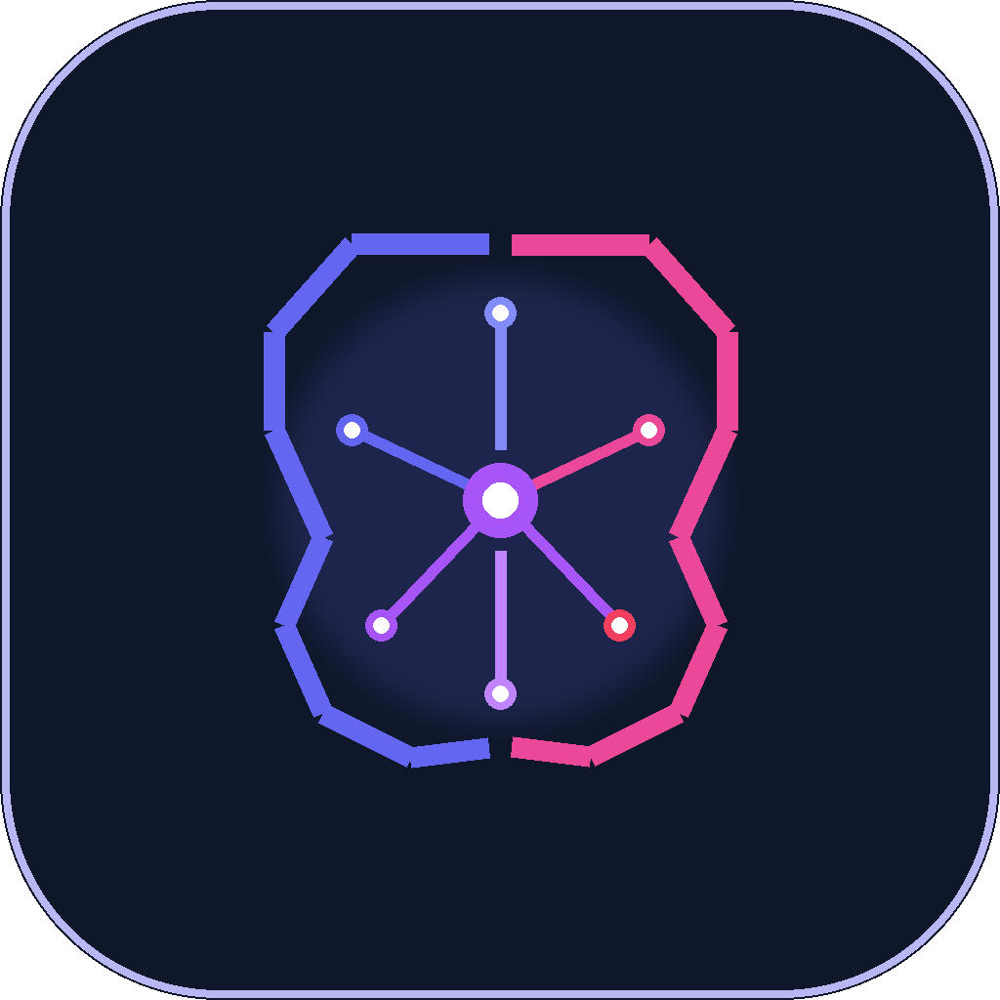

# 🧠 Daily Brain — AI-Powered Autonomous Task Management Agent

<p align="center">
  
</p>

<p align="center">
  <b>An autonomous AI productivity agent transforming plain English thoughts, assignments, and voice notes into prioritized tasks, step-by-step checklists, and deadline schedules.</b>
</p>

<p align="center">
  <a href="https://daily-brain-agent.streamlit.app"></a>
  
  
  
</p>

---

## 🌟 Key Highlights & Capabilities

- **🤖 Autonomous AI Agent (Gemini 3.6 Flash)**: Features automatic tool-calling and multi-step reasoning to parse messy natural language, compute real calendar dates, assign intelligent priorities, and manage tasks.
- **🎙️ Multimodal Voice Input**: Speak your tasks aloud directly in the app. Transcribed and scheduled instantly using Gemini multimodal audio capabilities.
- **📝 Hierarchical Subtask Checklists**: Break down complex engineering assignments, project milestones, or personal todos into granular, trackable steps.
- **🏷️ Category Tagging System**: Automatically classifies tasks with category tags (e.g. `#Academics`, `#Project`, `#Exam`, `#Personal`, `#Work`).
- **🚨 Deadline & Urgency Engine**: Real-time detection of overdue tasks, due-today reminders, and urgency sorting.
- **💻 Desktop App (Windows)**: Standalone desktop app with Microsoft Edge WebView2, desktop shortcuts, and Windows Inno Setup installer.
- **📱 Native Mobile Targets (Android & iOS)**: Complete Android Kotlin/Gradle and iOS SwiftUI/Xcode project configurations with runtime microphone bridges and offline status screens.
- **🌐 Progressive Web App (PWA)**: Installable directly from Chrome and Safari with full offline caching support.

---

## 🚀 Live Demo & Quick Launch

Experience the live deployed web application:
👉 **[https://daily-brain-agent.streamlit.app](https://daily-brain-agent.streamlit.app)**

### 📲 Install on Phone / PC
1. **Android**: Open link in Chrome ➡️ Tap menu `⋮` ➡️ **"Install app"** or **"Add to Home screen"**.
2. **iPhone**: Open link in Safari ➡️ Tap Share icon ➡️ **"Add to Home Screen"**.
3. **PC / Windows**: Run `DailyBrain.bat` or compile with `python build_desktop.py`.

---

## 💻 Local Setup & Development

### Prerequisites
- Python 3.10+
- Google Gemini API Key ([Get a free key at AI Studio](https://aistudio.google.com))

### Installation
```bash
# 1. Clone the repository
git clone https://github.com/Aabhipsa12/daily-brain-ai-agent.git
cd daily-brain-ai-agent

# 2. Install dependencies
pip install -r requirements.txt

# 3. Create .env file with your API key
echo GEMINI_API_KEY="your-gemini-api-key-here" > .env

# 4. Launch the application
streamlit run app.py
```

---

## 🛠️ Multi-Platform Build Pipeline

Daily Brain includes a unified build orchestrator:

```bash
# Build all platforms
python build_all.py

# Build specific target
python build_all.py --desktop    # Windows Standalone .exe
python build_all.py --android    # Android Gradle Project / APK
python build_all.py --ios        # iOS Xcode Project
python build_all.py --pwa        # Web / PWA verification
```

---

## 📚 Technical Documentation

- **[System Architecture](docs/ARCHITECTURE.md)**: Deep dive into the Agent tool-calling architecture, data flow, and isolation.
- **[Installation Guide](docs/INSTALL.md)**: Step-by-step setup for Web, Desktop, Android, and iOS.
- **[API & Tool Reference](docs/API.md)**: Agent tool definitions, parameters, and JSON schemas.
- **[Developer Guide](docs/DEVELOPMENT.md)**: Contributing guidelines, testing, and CI/CD pipelines.

---

## 📄 License
This project is licensed under the MIT License.
